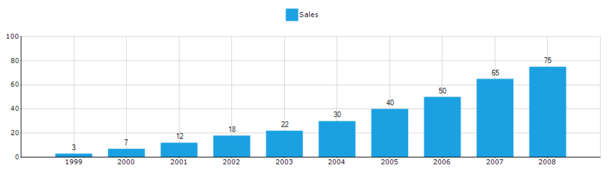

# Winforms-chart-getting-started

The [WinForms Chart](https://www.syncfusion.com/winforms-ui-controls/chart?utm_source=github&utm_medium=listing&utm_campaign=winforms-chart-github-samples) is used as a means to show the graphical representation of two values. For Example, a Line Chart can be used in health Statistic reports, in which it can show the rates over time or for a series of values, such as age-specific death rates. Logarithmic charts can be used in Share price charts where we plot between price and time. In logarithmic chart, we can identify the ‘Proportional change in price’ with respect to the ‘Change in time’. We use ‘Proportional change in price’ to observe market sentiment. Market participants move share prices either up or down proportionally depending on how bullish or bearish they feel.

## Features and benefits

### Chart types
The WinForms Chart control includes a comprehensive set of more than 45 [chart types](https://www.syncfusion.com/winforms-ui-controls/chart/types?utm_source=github&utm_medium=listing&utm_campaign=winforms-chart-github-samples) for all your business needs. Each one is highly and easily configurable with built-in support for creating stunning visual effects. 

### Chart real-time data
The Chart control can efficiently handle [real-time](https://www.syncfusion.com/kb/9344/how-to-create-a-real-time-chart-in-wf?utm_source=github&utm_medium=listing&utm_campaign=winforms-chart-github-samples) data as illustrated in the following screenshots. Updates are optimized to be smooth and flicker-free.

### Template support
Save time by persisting the appearance of a chart created at design time or runtime as a template. Apply the saved style to a new chart by loading the template.

### Zooming and scrolling
Enable the built-in zooming and scrolling features of a chart to provide users with great chart flexibility. 

### Panning support for zoomed chart
WinForms Graph supports panning a chart when it is zoomed. You can navigate to parts of the chart outside of the viewing area by simply clicking and dragging. 

### Axis label binding
Bind [axis](https://help.syncfusion.com/windowsforms/chart/chart-axes?utm_source=github&utm_medium=listing&utm_campaign=winforms-chart-github-samples) labels to pie, funnel, and pyramid charts. This feature displays data-bound labels in charts.

### LINQ support
Use LINQ to create varied, concise, and optimal views of your data. Bind to LINQ query results and view your data using many different chart types. Binding a LINQ query result to a chart and the resultant display are illustrated here.

### Excel importing and exporting
The WinForms Graph control can be used with the Syncfusion Excel Library to import data from Excel documents into a chart. Simpler Excel data can, of course, be loaded using the Microsoft Jet OLEDB data provider.

### 3D Mode
The Windows Forms Chart control supports 3D modes for all chart types except polar and radar charts.

### Color palette
The Chart comes with a set of color palettes that are automatically applied to a chart's data points if no custom colors are specified for the series. These built-in palettes offer a rich set of colors to render professional-looking charts.

## Related links
[Learn More about WinForms Chart Control](https://www.syncfusion.com/winforms-ui-controls/chart?utm_source=github&utm_medium=listing&utm_campaign=winforms-chart-github-samples)

[Download Free Trial](https://www.syncfusion.com/downloads/windowsforms?utm_source=github&utm_medium=listing&utm_campaign=winforms-chart-github-samples)

[Pricing](https://www.syncfusion.com/sales/products/windowsforms?utm_source=github&utm_medium=listing&utm_campaign=winforms-chart-github-samples)

[Documentation](https://help.syncfusion.com/windowsforms/chart/overview?utm_source=github&utm_medium=listing&utm_campaign=winforms-chart-github-samples)

[View Demos](https://github.com/syncfusion/winforms-demos?utm_source=github&utm_medium=listing&utm_campaign=winforms-chart-github-samples)

[Community Forums](https://www.syncfusion.com/forums/windowsforms?utm_source=github&utm_medium=listing&utm_campaign=winforms-chart-github-samples)

[Suggest a feature or report a bug](https://www.syncfusion.com/feedback/winforms?utm_source=github&utm_medium=listing&utm_campaign=winforms-chart-github-samples)

## About Syncfusion WinForms UI Controls
Syncfusion's [WinForms UI Controls](https://www.syncfusion.com/winforms-ui-controls?utm_source=github&utm_medium=listing&utm_campaign=winforms-chart-github-samples) library is the only suite that you will ever need to build an application since it contains over 100 high-performance, lightweight, modular, and responsive UI Controls in a single package. In addition to Chart, we provide popular WinForms Controls such as [DataGrid](https://www.syncfusion.com/winforms-ui-controls/datagrid?utm_source=github&utm_medium=listing&utm_campaign=winforms-chart-github-samples), [Scheduler](https://www.syncfusion.com/winforms-ui-controls/scheduler?utm_source=github&utm_medium=listing&utm_campaign=winforms-chart-github-samples), [Diagram](https://www.syncfusion.com/winforms-ui-controls/diagram?utm_source=github&utm_medium=listing&utm_campaign=winforms-chart-github-samples), and [Syntax editor](https://www.syncfusion.com/winforms-ui-controls/syntax-editor?utm_source=github&utm_medium=listing&utm_campaign=winforms-chart-github-samples).

## About Syncfusion
Founded in 2001 and headquartered in Research Triangle Park, N.C., Syncfusion has more than 27,000 customers and more than 1 million users, including large financial institutions, Fortune 500 companies, and global IT consultancies.

Today, we provide 1700+ components and frameworks for web ([Blazor](https://www.syncfusion.com/blazor-components?utm_source=github&utm_medium=listing&utm_campaign=winforms-chart-github-samples), [ASP.NET Core](https://www.syncfusion.com/aspnet-core-ui-controls?utm_source=github&utm_medium=listing&utm_campaign=winforms-chart-github-samples), [ASP.NET MVC](https://www.syncfusion.com/aspnet-mvc-ui-controls?utm_source=github&utm_medium=listing&utm_campaign=winforms-chart-github-samples), [ASP.NET WebForms](https://www.syncfusion.com/jquery/aspnet-webforms-ui-controls?utm_source=github&utm_medium=listing&utm_campaign=winforms-chart-github-samples), [JavaScript](https://www.syncfusion.com/javascript-ui-controls?utm_source=github&utm_medium=listing&utm_campaign=winforms-chart-github-samples), [Angular](https://www.syncfusion.com/angular-ui-components?utm_source=github&utm_medium=listing&utm_campaign=winforms-chart-github-samples), [React](https://www.syncfusion.com/react-ui-components?utm_source=github&utm_medium=listing&utm_campaign=winforms-chart-github-samples), [Vue](https://www.syncfusion.com/vue-ui-components?utm_source=github&utm_medium=listing&utm_campaign=winforms-chart-github-samples), and [Flutter](https://www.syncfusion.com/flutter-widgets?utm_source=github&utm_medium=listing&utm_campaign=winforms-chart-github-samples)), mobile ([Xamarin](https://www.syncfusion.com/xamarin-ui-controls?utm_source=github&utm_medium=listing&utm_campaign=winforms-chart-github-samples), [Flutter](https://www.syncfusion.com/flutter-widgets?utm_source=github&utm_medium=listing&utm_campaign=winforms-chart-github-samples), [UWP](https://www.syncfusion.com/uwp-ui-controls?utm_source=github&utm_medium=listing&utm_campaign=winforms-chart-github-samples), [JavaScript](https://www.syncfusion.com/javascript-ui-controls?utm_source=github&utm_medium=listing&utm_campaign=winforms-chart-github-samples), and [MAUI(Preview)](https://www.syncfusion.com/maui-controls?utm_source=github&utm_medium=listing&utm_campaign=winforms-chart-github-samples)), and desktop development ([WinForms](https://www.syncfusion.com/winforms-ui-controls?utm_source=github&utm_medium=listing&utm_campaign=winforms-chart-github-samples), [WPF](https://www.syncfusion.com/wpf-ui-controls?utm_source=github&utm_medium=listing&utm_campaign=winforms-chart-github-samples), [WinUI](https://www.syncfusion.com/winui-controls?utm_source=github&utm_medium=listing&utm_campaign=winforms-chart-github-samples), [Flutter](https://www.syncfusion.com/flutter-widgets?utm_source=github&utm_medium=listing&utm_campaign=winforms-chart-github-samples), [UWP](https://www.syncfusion.com/uwp-ui-controls?utm_source=github&utm_medium=listing&utm_campaign=winforms-chart-github-samples), and [MAUI(Preview)](https://www.syncfusion.com/maui-controls?utm_source=github&utm_medium=listing&utm_campaign=winforms-chart-github-samples)). We provide ready-to-deploy enterprise software for dashboards, reports, data integration, and big data processing. Many customers have saved millions in licensing fees by deploying our software.

This is a commercial product and requires a paid license for possession or use. Syncfusion’s licensed software, including this component, is subject to the terms and conditions of [Syncfusion's EULA](https://www.syncfusion.com/eula/es/?utm_source=github&utm_medium=listing&utm_campaign=winforms-chart-github-samples). To acquire a license, you can purchase one [here]( https://www.syncfusion.com/sales/products/windowsforms?utm_source=github&utm_medium=listing&utm_campaign=winforms-chart-github-samples) or start a free 30-day trial [here](https://www.syncfusion.com/account/manage-trials/start-trials?utm_source=github&utm_medium=listing&utm_campaign=winforms-chart-github-samples).

___

[sales@syncfusion.com](mailto:sales@syncfusion.com?Subject=Syncfusion WinForms Chart - GitHub) | [www.syncfusion.com](https://www.syncfusion.com?utm_source=github&utm_medium=listing&utm_campaign=winforms-chart-github-samples) | Toll Free: 1-888-9 DOTNET

